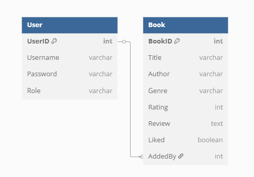

# BookLytics: A Bookstore Analytics Dashboard
BookLytics is a dynamic web application that allows users to explore, manage, and analyze books in an intuitive dashboard format. Developed using ASP.NET Core MVC, the application supports CRUD operations, API-based search, in-memory data persistence, and interactive analytics, all deployed on Azure.

## Tech Stack
- **Framework:** ASP.NET Core MVC
- **Frontend:** Razor Views, Bootstrap 5, Chart.js
- **Backend:** Singleton Services (`books.json` & `users.json`)
- **API Integration:** Google Books API
- **Deployment:** Azure App Service

---

## Features
- **CRUD Operations**: Add, update, view, and delete book records.  
- **Search Integration**: Uses Google Books API to fetch book data based on title or keyword.  
- **Filtering & Sorting**: Sort books by title, filter by "Liked" status.  
- **Analytics Dashboard**: Displays interactive charts (e.g., genre distribution, ratings).  
- **About Us Page**: Displays team roles, contributions, and the project overview.  
- **Live Deployment**: Hosted on Azure App Service for public access.  

---

## Project Structure (MVC)
```
📂 BookApp
├── Controllers/
│   └── BooksController.cs, HomeController.cs, AccountController.cs
├── Models/
│   └── Book.cs, User.cs, ErrorViewModel.cs
├── Services/
│   └── GoogleBookServices.cs, GoogleBookResponse.cs, IUserService.cs, JsonUserService.cs,	JsonBookRepository.cs, IGoogleBooksService.cs, IBookRepository.cs
├── Views/
│   ├── Books/ (Index, Analytics, Create, Delete, Details, Edit, Search, SearchResults)
│   ├── Home/ (Index, About)
|	├── Account/ (Login)
|	├── Shared/ (_Layout.cshtml, _ValidationScriptsPartial.cshtml) 
|	├── _ViewImports.cshtml
│   └── _ViewStart.cshtml
|
├── wwwroot/
│   ├── css/
│   ├── images/
│   ├── js/
│   └── lib/
|	
├── BookApp.csproj
├── BookApp.csproj.user
├── Program.cs
├──	appsettings.Development.json
├──	appsettings.json
├──	books.json
├──	users.json
└──	README.md


```

---

## API Integration using Google Books API
- **Endpoint:** `https://www.googleapis.com/books/v1/volumes?q={query}`
- **Purpose:** Fetch book details dynamically during search.
- **Usage:** Integrated in `SearchResults.cshtml` to show real-time results from Google Books.

---

## Logical Data Model (ERD)


```plaintext
User (UserID)
 ├── Username
 ├── Password
 ├── Role

Book (BookID)
 ├── Title
 ├── Author
 ├── Genre
 ├── Rating
 ├── Review
 ├── Liked
 └── AddedBy → User.UserID
```

---

## Deployment
**Live URL**: [https://booklytics-ezedc5bjcda2cgeb.canadacentral-01.azurewebsites.net/](https://booklytics-ezedc5bjcda2cgeb.canadacentral-01.azurewebsites.net/)
**Platform**: Azure App Service  
**Code**: [GitHub Repository](https://github.com/AbinayalakshmiG/BookApp)

---

## Team Contributions
### **Onisha Gangwal**
**Phase 1 Contributions:**  
Led the team’s planning and organization. Developed the homepage and consistent navigation with a responsive layout and standardized design.
**Phase 2 Contributions:**  
Integrated the static site’s styling into Razor views, ensured cohesive UI across pages, and handled the full project documentation including ERD, Git log, and README.

### **Abinaya Ganesan**
**Phase 1 Contributions:**  
Designed and developed the static CRUD pages and supported planning sessions for data interaction flow.
**Phase 2 Contributions:**  
Set up the MVC project structure, created domain models, implemented full CRUD using singleton services, and integrated the Google Books API.

### **Prajay Khandelwal**
**Phase 1 Contributions:**  
Built three data visualizations using Chart.js and structured the visual layout for insights.
**Phase 2 Contributions:**  
Implemented filtering and sorting functionalities, updated dynamic Chart.js components, created the presentation deck, and recorded the demo.

### **Aayushi Nirajkumar Desai**
**Phase 1 Contributions:**  
Created and styled the About Us page, structured team content, and contributed to logical model explanation.
**Phase 2 Contributions:**  
Deployed the final MVC application to Azure, ensured deployment testing across devices, and collaborated on UI layout consistency and testing.

---

## Challenges & Solutions
| Challenge | Solution |
|----------|----------|
| API data mismatch | Parsed Google Books API responses to match app structure |
| Styling inconsistencies post-conversion | Reapplied custom Bootstrap styling from static site into MVC Razor views |
| Azure deployment failure due to .NET SDK | Resolved by upgrading target SDK and reconfiguring App Service pipeline |
| Front End and Back and Integration | Resolved by creating a new Repo for full-stack app |

---

## Git Log
Git commit history demonstrates active contribution by all members. View commit logs [here](https://github.com/AbinayalakshmiG/BookApp/commits/main/).

---

## License
This project was built for academic purposes as part of the **Application Development for Analytics** course. All content is original and open for educational use.
